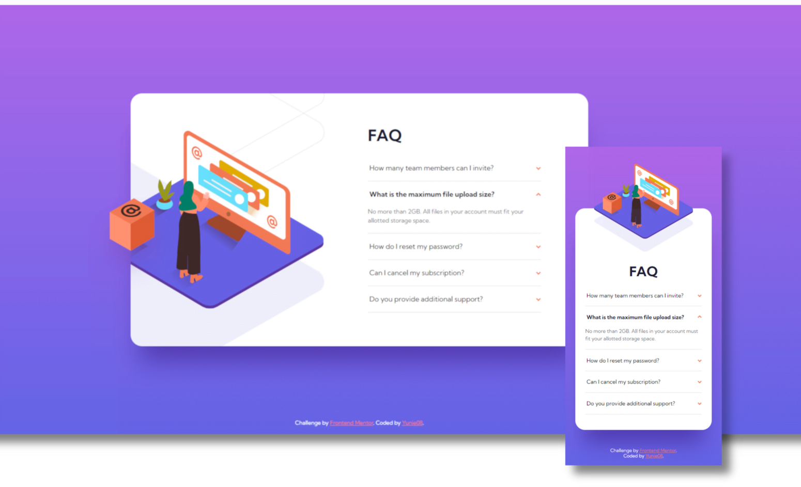

# Frontend Mentor - GitHub user search app solution

This is my solution to the [FAQ accordion card challenge on Frontend Mentor](https://www.frontendmentor.io/challenges/github-user-search-app-Q09YOgaH6). 

## Table of contents

- [Overview](#overview)
  - [The challenge](#the-challenge)
  - [Screenshot](#screenshot)
  - [Links](#links)
- [My process](#my-process)
  - [Built with](#built-with)
  - [What I learned](#what-i-learned)
  - [Continued development](#continued-development)
  - [Useful resources](#useful-resources)
- [Author](#author)

## Overview

### The challenge

Users should be able to:

- View the optimal layout for the component depending on their device's screen size
- See hover states for all interactive elements on the page
- Hide/Show the answer to a question when the question is clicked

### Screenshot

### Links

- Solution URL: [Github user search app - Go to Github Repository](https://github.com/Yunie08/frontend-mentor-github-user-search-app.git)
- Live Site URL: [Github user search app - Go to live site](https://yunie08.github.io/frontend-mentor-github-user-search-app/)

## My process

### Built with

- Semantic HTML5 markup
- CSS custom properties
- Flexbox
- CSS Grid
- Javascript
- Mobile-first workflow

### What I learned

- How to implement a dark mode
- How to have the correct color scheme chosen for the user based on their computer preferences
- This project also allowed me to gain more experience with fetching APIs.

### Continued development

- __Improvement on this project:__
  - Currently working on implementing a cleaner solution for dark mode 
  - I would like to implement a delayed rendering of the page until API fetch is done
  - Add backup values in case variables are not correctly loaded

### Useful resources

- [Great article about prefers-color-scheme](https://web.dev/prefers-color-scheme/) - This helped me with dark mode and prefers-color-scheme
- [Great article about dark mode](https://www.ditdot.hr/en/dark-mode-website-tutorial) - This helped me with dark mode

## Author

Come say hi ! 

- GitHub - [Ambre Gorias](https://github.com/Yunie08)
- Frontend Mentor - [@Yunie08](https://www.frontendmentor.io/profile/Yunie08)
- Twitter - [@YunieBou](https://www.twitter.com/YunieBou)

